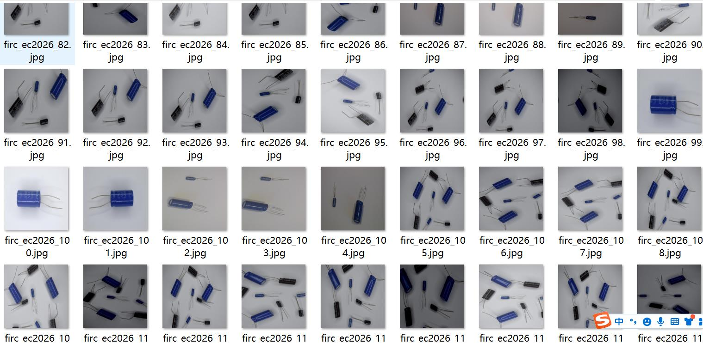
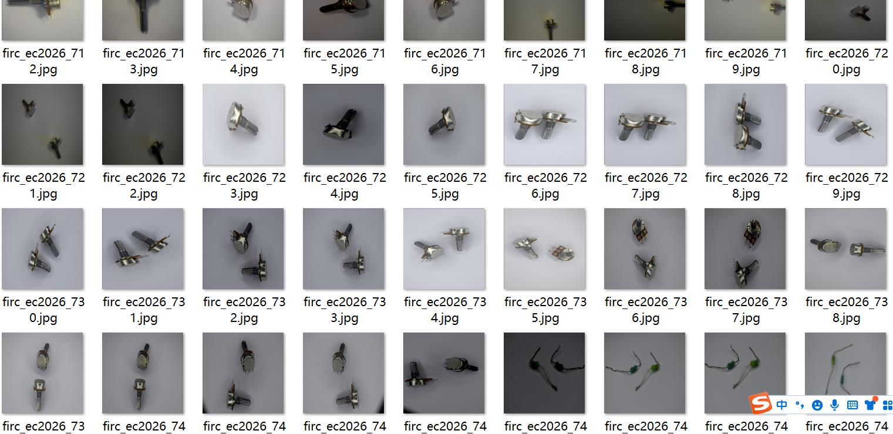
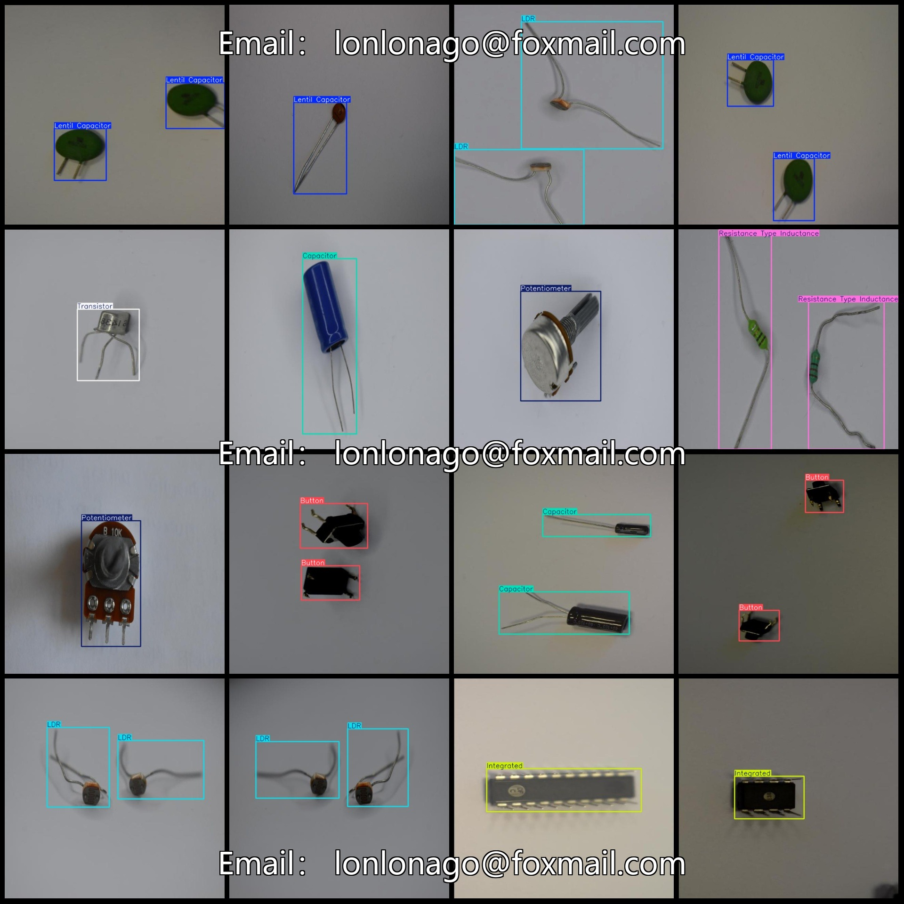
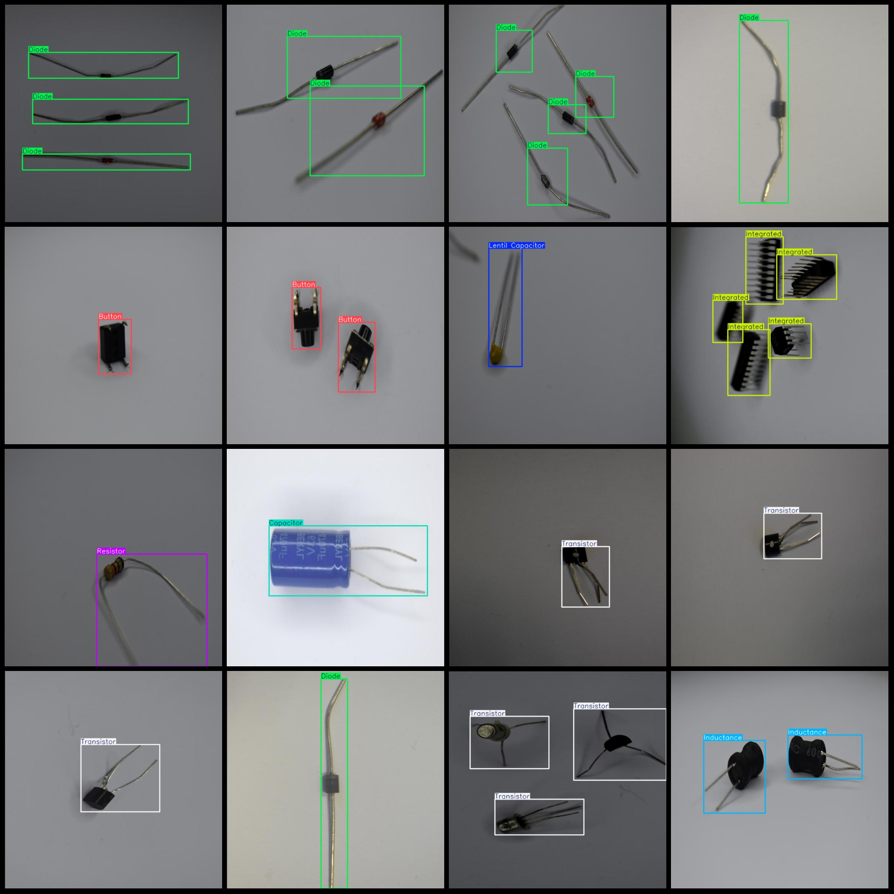

# Electronic Components Board Assembly Detection Data Set VOC+YOLO with 995 12-classification

Dataset format: Pascal VOC format + YOLO format (without split path's txtfile, only containing jpgimage and corresponding VOC format xmlfile and yolo format txtfile)

number of images: 995
annotation count: 995
annotation count: 995
annotationnumber of classes: 12
Annotation class names: ["Button", "Capacitor", "Diode", "Inductance", "Integrated", "LDR", "LED", "Lentil Capacitor", "Potentiometer", "Resistance Type Inductance", "Resistor"]
"Transistor"]

boxes per class: 
The count of buttons (button boxes) is 122.
The count of capacitors (capacitor boxes) is 296.
The count of diodes (diode boxes) is 216.
The count of inductances (inductance boxes) is 115.
The count of integrated circuits (integrated circuit boxes) is 251.
The count of LDR (Light-Dependent Resistor) boxes is 141.
The count of LED (Light Emitting Diode) boxes is 238.
The count of lentil capacitors (chip capacitors) is 234.
The count of potentiometers (potentiometer boxes) is 139.
The count of resistance type inductances (resistor inductance boxes) is 132.
The count of resistors (resistor boxes) is 133.
The count of transistors (transistor boxes) is 201.
total boxes: 2218
image resolution: 640x640
Annotation tool: labelImg
Annotation rules: Draw a rectangle around the class.
Important notes: There are no special statements at this time.
Special statement: This dataset does not guarantee the accuracy of the trained model or weight file.
Image preview:
## Images

Here is a pay link on Stripe ( https://buy.stripe.com/3cs8yP7sY87d0vu9AB ). Please contact me lonlonago@foxmail.com after funding $89, and I will send you a complete data files , thank you!

